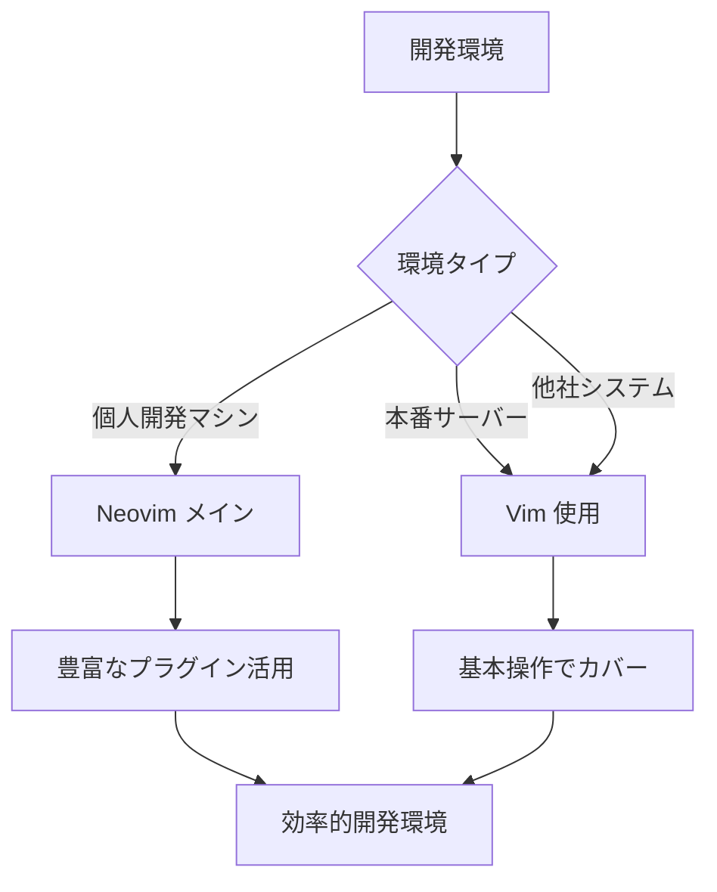

# VimとNeovimの違い 早見表

## 📊 基本情報比較

| 項目 | Vim | Neovim |
|------|-----|--------|
| **ベース** | Vi | Vim |
| **位置づけ** | 元祖改良版 | モダン版 |

## 🔍 主要な違い（7項目）

### 1. 👁️ カーソル表示
```
Vim:        ■ → ■ (変化なし)
           Normal  Insert

Neovim:     ■ → | (視覚的に区別)
           Normal Insert
```

### 2. 🖥️ ターミナルモード
| 機能 | Vim | Neovim |
|------|-----|--------|
| **起動方法** | `:term` | `:term` |
| **表示形式** | 画面分割 | バッファ全体 |
| **初期状態** | すぐ入力可能 | ノーマルモード |
| **使いやすさ** | ⭐⭐⭐⭐ | ⭐⭐⭐ (設定で改善可) |

### 3. ⚙️ 設定言語
```
Vim:     [Vimscript] のみ

Neovim:  [Vimscript] + [Lua]
         └─ より学習しやすい
         └─ 最新プラグイン対応
```

### 4. 💾 インストール状況
| 環境 | Vim | Neovim |
|------|-----|--------|
| **Unix系OS** | ✅ デフォルト | ❌ 手動インストール |
| **本番サーバー** | ✅ 使用可能 | ❓ 制限される場合あり |
| **学習環境** | ⭐⭐⭐ | ⭐⭐⭐⭐⭐ |

### 5. 📁 設定ファイル配置
```
Vim:     ~/.vimrc (単一ファイル)

Neovim:  ~/.config/nvim/
         ├── init.vim (or init.lua)
         ├── lua/
         └── plugin/ (構造化可能)
```

### 6. ↩️ アンドゥ動作
本質的には違いがありません。
しかし、Neovimのバージョンやプラグイン設定などによって
下記のような違いが生じる場合があります。

| エディタ | 履歴の単位 | 特徴 |
|----------|------------|------|
| **Vim** | インサートセッション全体 | Enterを押しても継続 |
| **Neovim** | Enter区切り | より細かい制御 |

※ nvim -u NONEなどで起動した場合は、vimと同様の挙動になります。

### 7. 🔌 プラグインエコシステム
```
Vim:     [従来プラグイン豊富] 
         └─ 長い歴史、安定

Neovim:  [従来プラグイン] + [専用プラグイン]
         ├─ Telescope.nvim (ファジーファインダー)
         ├─ toggleterm.nvim (ターミナル管理)
         ├─ nvim-treesitter (シンタックス強化)
         └─ 充実したLSPサポート
```

## 🎯 選択指針

### 🚀 Neovimがおすすめな人
- ✅ **初心者**: 視覚的フィードバック豊富
- ✅ **IDE環境希望**: VSCode風の高機能環境
- ✅ **最新技術好き**: 活発な開発コミュニティ
- ✅ **学習効率重視**: モダンなプラグイン群

### 🛡️ Vimがおすすめな人
- ✅ **シンプル重視**: 軽量・高速
- ✅ **サーバー作業多**: どこでも使える
- ✅ **Unix思想**: 小さなソフトウェア哲学
- ✅ **既存設定活用**: 大量のVim設定資産

## 📈 実践的な使い分け戦略



## 💡 学習ロードマップ

### Phase 1: 基礎習得
```
1. Vim基本操作の習得 (両方で共通)
   ├── モード操作 (Normal/Insert/Visual)
   ├── 基本移動・編集
   └── 基本コマンド

2. どちらか選択
   ├── Neovim → モダン環境構築
   └── Vim → シンプル極める
```

### Phase 2: 環境構築
```
Neovim選択の場合:
├── 基本設定 (init.vim)
├── プラグイン導入 (vim-plug等)
├── LSP設定
└── ターミナル連携 (tmux/zellij)

Vim選択の場合:
├── .vimrc設定
├── 厳選プラグイン
└── ターミナル連携
```

## 🏆 まとめ

| 観点 | 結論 |
|------|------|
| **総合おすすめ** | 🥇 **Neovim** (制約がない場合) |
| **学習戦略** | 🎯 **併用** (Neovim主, Vim副) |
| **将来性** | 📈 **Neovim** (活発な開発) |
| **安定性** | 🛡️ **Vim** (枯れた技術) |

### 🎪 最終的な選択基準
> **「どこでも使える汎用性」** + **「リッチな開発環境」** = **両方習得**

---

*💬 エディタは信仰の自由。この表を参考に、あなたに最適な選択を！*
